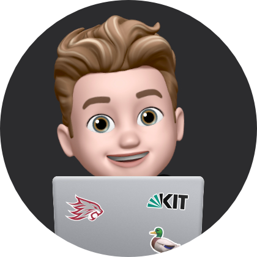

# Nicolas' UX Portfolio

Hi, I am Nicolas Gres and welcome to my UX Portfolio 👋

I am an exchange student at Chico State from Germany studying at [KIT](https://www.kit.edu/english/index.php) with an interest in mobile app development and UI/UX design.

## UX Team Project

[GoodDays](https://chicostate.github.io/ux-GoodDays/)

## UX Journal

[The *Toast Incinerator* 🔥](j01/)

