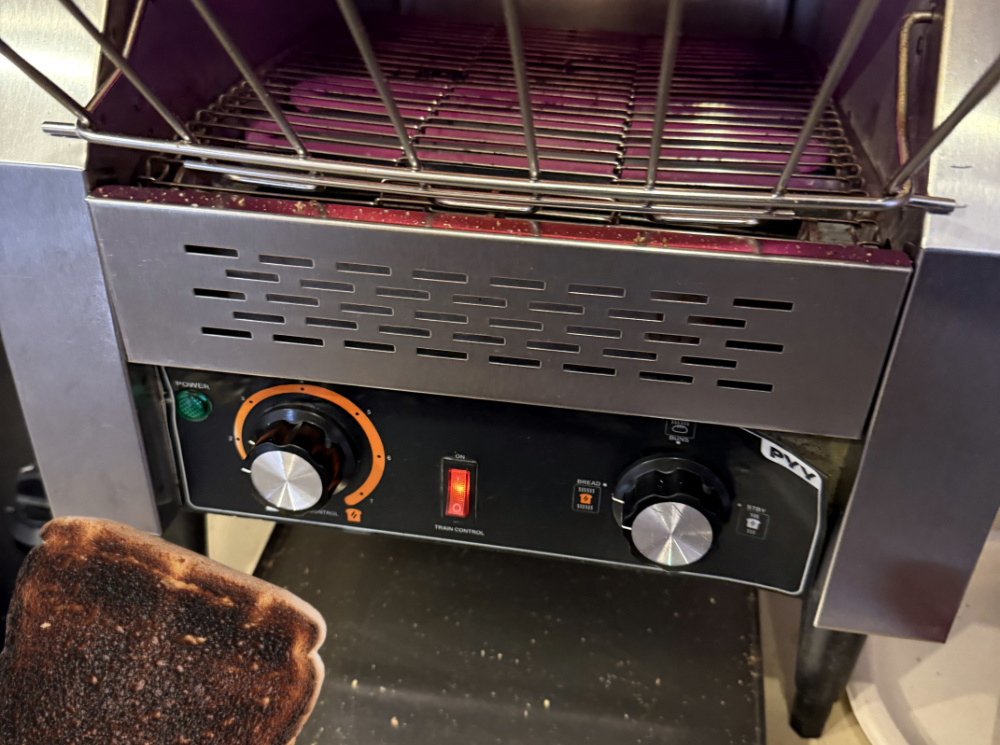
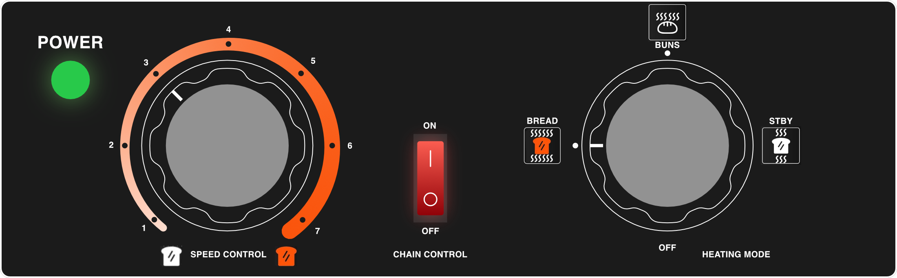

# The *Toast Incinerator* 🔥

During my trip to San Francisco, I encountered the following toaster in my hostel:

The problem was, that the toast came out a bit too crispy. Trying to adjust the settings, I was confronted with the following interface:

> So how do you prevent your toast from burning?

To solve this task, we subconsciously start to build a *mental model* when we interact with a user interface like this. Such a model is our inner representation of how the appliance works and how we can control it.  
The *toastiness* $\tau$ is controlled by two variables. The heat $h$ of the toaster and the rotational speed $v$ of the chain.

$$
\tau \sim h \cdot v^{-1}
$$

