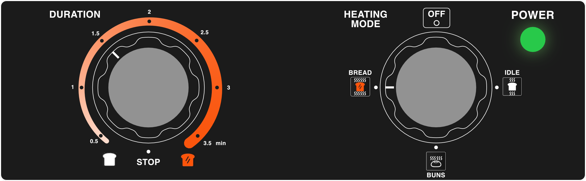

# The *Toast Incinerator* 🔥

Picture this: you are on a weekend trip to San Francisco, making breakfast in your hostel. You want to toast a slice of bread and come across this peculiar conveyor toaster:

The problem? The toast is a bit too crispy. As you try to adjust the settings, you are met with this interface:

> How do you prevent your toast from burning?

To solve this task, we subconsciously start to build a **mental model** when we interact with a user interface (UI) like this. Such a model is our inner representation of how the appliance works and how we can control it.  
The *toastiness* $\tau$ is controlled by two variables. The heat $h$ of the toaster and the rotational speed $v$ of the chain.

$$
\tau \sim h \cdot v^{-1}
$$

The heat can be controlled using the knob on the right, as indicated by the small label underneath the knob. However, the discrete heating modes do not allow for a continuous adjustment as they are intended for different types of bread.

The knob on the left controls the speed, offering a good range of levels. However, there is a catch: which way should we turn the knob?
Since $\tau$ is inversely proportional to $v$, increasing speed would decrease toastiness. This means we would need to turn the knob counterclockwise to prevent burning. 
However, in this toaster, the number 1 is actually the fastest speed, while the number 7 is the slowest. So, we would need to turn the knob clockwise.
The labeling on the machine is confusing, making it difficult to map the controls to our mental model.

This is not the only issue with this user interface. 
Imagine you are a new employee of the hostel, exhausted from a long Friday shift. The last thing you have to do is turn off all the appliances in the dining area.

> How would you turn off the toaster?

The most obvious choice would be to press the red-glowing switch in the middle of the device. However, as the *chain control* label indicates, this does not turn off the device. Instead, it keeps the heating on and stops the chain, causing any remaining pieces of bread to catch fire.

The correct action would have been to turn the heating mode knob to the bottom position, as indicated by the *off* label. This highlights how poor UI design, even for simple devices like toasters, can pose a dangerous hazard.

> How to fix it?

To address these issues, we could improve the *speed* label by calling it *duration*. This would make the knob more intuitive and proportional to the controlled variable (time). Additionally, we could eliminate the chain control switch and incorporate it as a state in the *duration* knob.

